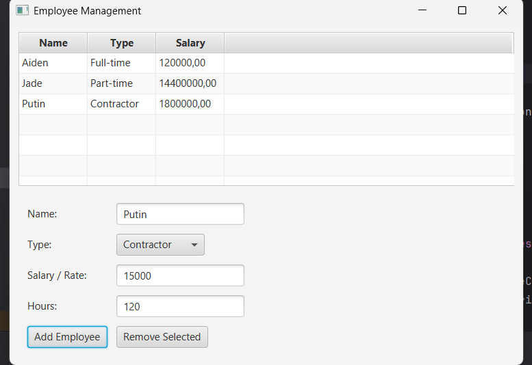
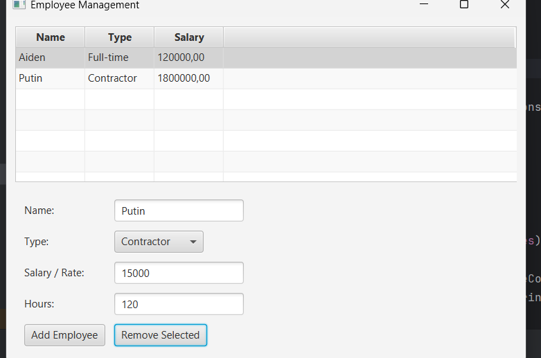

# Employee Management System - README

## Overview

The **Employee Management System** is a JavaFX application designed to manage employees, their types, and salaries. It allows users to add, view, and remove employees from the system, as well as calculate their respective salaries based on the type of employment. The system supports three types of employees:

- **Full-time Employee**
- **Part-time Employee**
- **Contractor**

### Requirements

Before running the application, make sure that the following software is installed and configured:

1. **Java Development Kit (JDK)** version 17 or later.
2. **JavaFX SDK**: Download from the official [JavaFX website](https://openjfx.io/).
3. An IDE like **IntelliJ IDEA**, **Eclipse**, or **NetBeans** (for easier project setup and running).

## Setup Instructions

### 1. Clone or Download the Project Files

Start by downloading or cloning the project files to your local machine. Ensure that the Java source files, such as:

- `EmployeeManagementApp.java`
- `FullTimeEmployee.java`
- `PartTimeEmployee.java`
- `Contractor.java`

are in the same directory or package.

### 2. Configure JavaFX in Your IDE

#### For IntelliJ IDEA:
1. Open the project.
2. Navigate to **File** > **Project Structure** > **Libraries**.
3. Add the JavaFX SDK's `lib` directory as a new library.
4. Update the **VM Options** with the following:

    ```
    --module-path /path/to/javafx-sdk/lib --add-modules javafx.controls,javafx.fxml
    ```

#### For Eclipse:
1. Right-click the project folder and choose **Build Path** > **Configure Build Path**.
2. Add the JavaFX SDK `lib` folder to the project's libraries.
3. Ensure that the VM options are updated with:

    ```
    --module-path /path/to/javafx-sdk/lib --add-modules javafx.controls,javafx.fxml
    ```

### 3. Compile and Run the Program

To run the application, follow these steps:

#### In IntelliJ IDEA:
1. Open the `EmployeeManagementApp.java` file.
2. Right-click on the file and select **Run 'EmployeeManagementApp'**.

#### In Eclipse:
1. Right-click on the `EmployeeManagementApp` class.
2. Select **Run As** > **Java Application**.

#### From the Command Line:
1. Navigate to the project directory.
2. Compile the program using the following command:

    ```bash
    javac --module-path /path/to/javafx-sdk/lib --add-modules javafx.controls,javafx.fxml *.java
    ```

3. Run the application with:

    ```bash
    java --module-path /path/to/javafx-sdk/lib --add-modules javafx.controls,javafx.fxml EmployeeManagementApp
    ```

## How to Use the Application

### 1. Add Employees
- Enter the **Name**, **Employee Type** (Full-time, Part-time, or Contractor), **Salary**, and (for Part-time and Contractor) **Hours Worked**.
- Click the **Add Employee** button to add the new employee to the table.

### 2. View Employees
- The table will display all the employees, showing their name, type, and calculated salary.

### 3. Remove Employees
- Select an employee from the table and click **Remove Selected** to delete them from the list.

### 4. Calculate Salaries
- The application will automatically update the salary of each employee and display it in the table.

---

This system provides a simple yet efficient way to manage employee data, calculate salaries, and maintain an organized list of employees.



